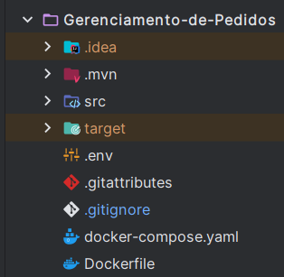

## Descrição do projeto
Esta API simula um sistema básico de gerenciamento de pedidos em um restaurante, incluindo funcionalidades como criação de produtos (alimentos), abertura de novos pedidos e adição de itens. Além disso, oferece recursos para edição, pesquisa e exclusão de produtos, pedidos e itens de pedidos.

## Tecnologias utilizadas:

- Java 21
- Spring Boot
- Spring JPA
- Maven
- Swagger/OpenAPI 
- Docker e Docker Compose

## Estrutura do projeto
```bash
Gerenciamento-de-pedidos
├── src
│   └── main
│       ├── java
│       │   ├── com
│       │        └── gerenciamento
│       │            └── pedidos
│       │               ├── config               # Configurações gerais (Swagger, tipo de retorno dos dados, etc)
│       │               ├── controller           # Camada de controle (endpoints REST)
│       │               ├── dto                  # Objetos de transferência de dados (DTOs)
│       │               ├── exception            # Tratamento de exceções customizadas
│       │               ├── model                # Entidades JPA (Pedido, Produto e Item do pedido)
│       │               ├── repository           # Interfaces JPA (acesso ao banco de dados)
│       │               ├── service              # Camada de serviço (regras de negócio)
│       │               ├── utils                # Configurações úteis (Hateoas, etc)
│       │               └── Startup              # Classe principal da aplicação com método main()   
│       ├── resources
│       │   ├── db
│       │   │   └── migration                   # Scripts SQL para migrations
│       │   └── application.yaml                # Configurações da aplicação (porta, DB, etc)
│       tests
│        └── java
│              ├── com
│                  └── gerenciamento
│                       └── pedidos
│                             ├── mocks         # Classes que geram dados mockados
│                             ├── service       # Classes de testes
│                             └── StartupTests  # Classe principal dos testes com método main()
├── Dockerfile                                  # Dockerfile para build da imagem da aplicação
├── docker-compose.yml                          # Orquestração dos serviços (app + banco)
├── pom.xml                                     # Dependências do Maven
└── README.md                                   # Documentação do projeto
```

## Funcionalidades Implementadas
### Gerenciamento de Produtos
1. Criar, listar, atualizar e excluir produtos. 
   - Cada produto possui:
     - `nome`
     - `preço`
     - `categoria (BEBIDA, ENTRADA, PRATO_PRINCIPAL, SOBREMESA)`

### Gerenciamento do Iten do pedido.
   - Criar, listar, atualizar e excluir itens.
   - Cada item possui:
     - Um `produto`
     - `Qauntidade` desejada do produto

### Gerenciamento de Pedidos
   - Criar, listar e excluir pedidos. 
   - Cada pedido contém:
     - `Um ou vários Itens` 
     - `Valor total` automaticamente calculado

## Endpoints

### Pedidos (`/api/v1/orders`)

* `GET /api/v1/orders` — Listar todos os pedidos
* `GET /api/v1/orders/{id}` — Obter pedido por ID
* `POST /api/v1/orders` — Criar novo pedido via body
* `DELETE /api/v1/orders/{id}` — Deletar pedido


### Produtos (`/api/v1/products`)

* `GET /api/v1/products` — Listar todos os produtos
* `GET /api/v1/products/{id}` — Obter produto por ID
* `POST /api/v1/products` — Criar novo produto via body
* `PUT /api/v1/products/{id}` — Atualizar produto via ID e body
* `DELETE /api/v1/products/{id}` — Deletar produto

### Itens do Pedido (`/api/v1/items`)

* `GET /api/v1/items` — Listar todos os itens de pedidos
* `GET /api/v1/items/{itemId}` — Obter item de pedido por ID
* `POST /api/v1/items/order/{orderId}` — Adicionar um produto via body ao item e adicioná-lo a um pedido existente
* `PUT /api/v1/items/{id}` — Atualizar item do pedido via ID e body
* `DELETE /api/v1/items/{id}` — Deletar item do pedido

### Observação
* Todos os endpoints suportam os formatos: `application/json`, `application/xml` e `application/yaml`.

## Alguns exemplos de Requisições

### Criar Produto

**Endpoint:** `POST /api/v1/products`
**Content-Type:** `application/json`

```json
{
  "name": "Refrigerante",
  "price": 7.50,
  "category_product": "BEBIDA"
}
```
### Buscar Produto por ID

**Endpoint:** `GET /api/v1/products/{id}`
Sem corpo (body). Retorna um JSON como:

```json
{
  "id": 3,
  "name": "Refrigerante",
  "price": 7.5,
  "category": "BEBIDA"
}
```

### Criar Pedido

**Endpoint:** `POST /api/v1/orders`
**Content-Type:** `application/json`

```json
{
  "full_value": 0.0 -----> Será atualizado quando um item for adicionado
}
```

### Adicionar Item ao Pedido

**Endpoint:** `POST /api/v1/items/order/{orderId}`
**Content-Type:** `application/json`
**Exemplo para orderId = 1:**

```json
{
  "product" {
      "id": 1
   },
  "quantity": 2
}
```

### Atualizar Item do pedido

**Endpoint:** `PUT /api/v1/items/{id}`
**Content-Type:** `application/json`
**Exemplo para o item de id = 1:**

```json
{
  "product" {
      "id": 2
   },
  "quantity": 6
}
```
### Excluir Pedido

**Endpoint:** `DELETE /api/v1/orders/{id}`
Sem corpo (body). Basta informar o `id` na URL.

### Atualizar Produto

**Endpoint:** `PUT /api/v1/products/{id}`
**Exemplo para id = 3:**

```json
{
  "name": "Suco Natural",
  "price": 8.00,
  "category": "BEBIDA"
}
```

## Documentação dos Endpoints
Todos os endpoints foram documentados com `Swagger/OpenAPI` disponível para visualização e testes interativos.
Após inciar o projeto acesse via:
```bash
   http://localhost:8080/swagger-ui/index.html
```

## Como rodar a aplicação na sua máquina

### Configuração do Ambiente

### Pré-requisitos

* Antes de começar, certifique-se de ter o [Docker Desktop](https://www.docker.com/products/docker-desktop/) e **em execução** em sua máquina.
* [Postman](https://www.postman.com/downloads/) instalado para a realização de testes na aplicação ou se prefirir, pode realizar os testes via swagger

### Passos para Iniciar o Projeto

1.  **Obtenha os Arquivos do Projeto:**
* **Recomendado - Via terminal do Git:** clone-o para sua máquina:
    ```bash
    git clone https://github.com/Glaudencio12/API-gerenciamento-de-pedidos-com-spring-boot
    ```
2. **Configure as Variáveis de Ambiente**
* Crie um arquivo `.env` com as credenciais desejadas para que o mysql possa funcionar dentro do container.
* Esse arquivo `.env` deve ser criado na raiz no projeto:

 

* Exemplo de .env:
```env
MYSQL_DB_URL=jdbc:mysql://localhost:3306/gerenciamento_pedidos?useTimezone=true&serverTimezone=UTC  # URL de conexão local do MySQL
MYSQL_DB_USERNAME=root  # Usuário root do MySQL
MYSQL_DB_PASSWORD=admin123  # Senha do usuário root

MYSQL_USER=usuario  # Usuário criado no banco para a aplicação
MYSQL_PASSWORD=senha123  # Senha do usuário criado para a aplicação

SPRING_DATASOURCE_URL=jdbc:mysql://db:3306/gerenciamento_pedidos?useTimezone=true&serverTimezone=UTC  # URL de conexão do banco dentro do container Docker
SPRING_DATASOURCE_USERNAME=usuario  # Usuário usado pela aplicação para conectar ao banco
SPRING_DATASOURCE_PASSWORD=senha123  # Senha usada pela aplicação para conectar ao banco
```
3. **Inicie os Serviços com Docker Compose**
* Navegue até a pasta raiz do projeto no seu terminal e execute os comandos abaixo.
    * **Importante:** Certifique-se de que os arquivos `docker-compose.yml` e o `Dockerfile` da aplicação estejam no diretório atual quando você abrir o terminal
   ```bash
   docker compose pull glaudencio123/gerenciamento-de-pedidos:v4
   ```
  Esse comando irá:
    * Baixar a imagem da aplicação do Docker Hub
   
* Apoós executar o comando acima, execute:
    ```bash
   docker compose up -d
   ```
    Esse comando irá:
     * Subir o banco MySQL e a aplicação conectados em rede


4.  **Verifique a Execução dos Contêineres:**
* Você pode confirmar que os contêineres estão rodando de duas maneiras:
    * **Via Terminal:** Execute `docker ps` para ver uma lista dos contêineres ativos ou execute`docker container ls`, que terá o mesmo resultado 
5.  **Acesse a Aplicação:**
* Com os serviços em funcionamento, você pode testar a aplicação usando o Postaman ou o Swagger via: 
```bash
  http://localhost:8080/swagger-ui/index.html
```

### Gerenciamento dos Contêineres

* **Para parar os serviços da aplicação execute:**
    ```bash
    docker compose stop
    ```
